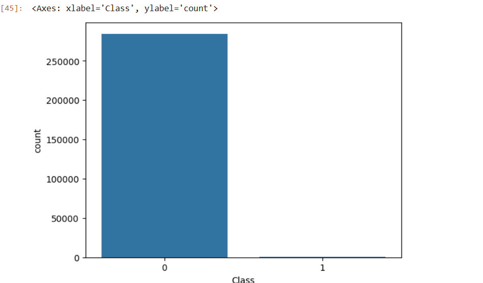
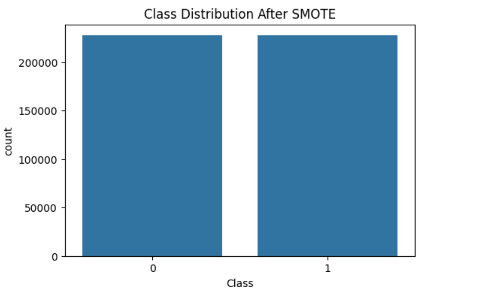
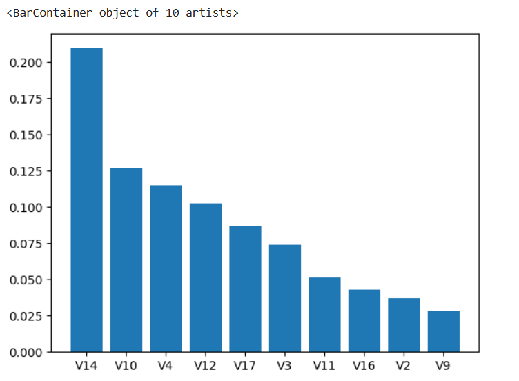

# Credit-Card-Fraud-Detection
Machine Learning based Credit Card Fraud Detection using SMOTE and Random Forest.
# 💳 Credit Card Fraud Detection using Machine Learning

## 📌 Overview

Credit card fraud is a critical challenge in the financial industry due to the large volume of daily transactions and the rarity of fraudulent activities. This project focuses on detecting fraudulent credit card transactions using Machine Learning techniques on a highly imbalanced dataset.

The project includes data preprocessing, exploratory data analysis, handling class imbalance using SMOTE, and building classification models to accurately identify fraudulent transactions.

---

## 🎯 Objectives

* Detect fraudulent credit card transactions.
* Analyze and handle highly imbalanced data.
* Compare Logistic Regression and Random Forest models.
* Improve fraud detection using SMOTE.
* Evaluate model performance using Precision, Recall, F1-Score, and Confusion Matrix.
* Identify the most influential features contributing to fraud detection.

---

## 📊 Dataset Information

| Attribute               | Value                  |
| ----------------------- | ---------------------- |
| Total Transactions      | 284,807                |
| Genuine Transactions    | 284,315                |
| Fraudulent Transactions | 492                    |
| Features                | 30                     |
| Target Classes          | 0 = Genuine, 1 = Fraud |

Dataset Source: Kaggle Credit Card Fraud Detection Dataset

---

## 🛠️ Technologies Used

* Python
* Pandas
* NumPy
* Matplotlib
* Seaborn
* Scikit-Learn
* Imbalanced-Learn (SMOTE)
* Joblib

---

# 📈 Exploratory Data Analysis

## Class Distribution Before SMOTE



The original dataset is highly imbalanced, with fraudulent transactions representing less than 1% of the total records.

---

## Class Distribution After SMOTE



SMOTE (Synthetic Minority Oversampling Technique) was applied to generate synthetic fraud samples and balance the training dataset.

---

# 🤖 Machine Learning Models

## Logistic Regression

Used as the baseline classification model.

### Performance

| Metric    | Score |
| --------- | ----- |
| Precision | 0.83  |
| Recall    | 0.66  |
| F1-Score  | 0.74  |

---

## Random Forest Classifier

Random Forest delivered the best overall performance and was selected as the final model.

### Performance

| Metric    | Score  |
| --------- | ------ |
| Accuracy  | 99.94% |
| Precision | 0.83   |
| Recall    | 0.83   |
| F1-Score  | 0.83   |

### Confusion Matrix

|                | Predicted Genuine | Predicted Fraud |
| -------------- | ----------------- | --------------- |
| Actual Genuine | 56847             | 17              |
| Actual Fraud   | 17                | 81              |

### Key Findings

* Correctly detected **81 out of 98 fraudulent transactions**.
* Achieved a strong balance between fraud detection and false positive rates.
* Random Forest outperformed Logistic Regression on fraud detection performance.

---

# 📊 Feature Importance Analysis

The Random Forest model identified the following features as the most important contributors to fraud detection:

1. V14
2. V10
3. V4
4. V12
5. V17
6. V3
7. V11
8. V16
9. V2
10. V9

## Top 10 Important Features



V14 was identified as the most influential feature with the highest importance score in the Random Forest model.

---

# 📂 Project Structure

```text
Credit-Card-Fraud-Detection/
│
├── notebook/
│   └── credit-card-fraud-detection.ipynb
│
├── model/
│   └── fraud_detection_model.pkl
│
├── images/
│   ├── before_smote.png
│   ├── aftersmote.png
│   └── features.png
│
└── README.md
```

---

# 🚀 Future Improvements

* Hyperparameter tuning for improved performance.
* XGBoost and LightGBM model comparison.
* Real-time fraud detection API.
* Streamlit web application deployment.
* Automated model monitoring and retraining pipeline.

---

# 👨‍💻 Author
B.Shravya
Developed as a Machine Learning project to explore fraud detection techniques on highly imbalanced financial datasets using SMOTE and Random Forest classification.

